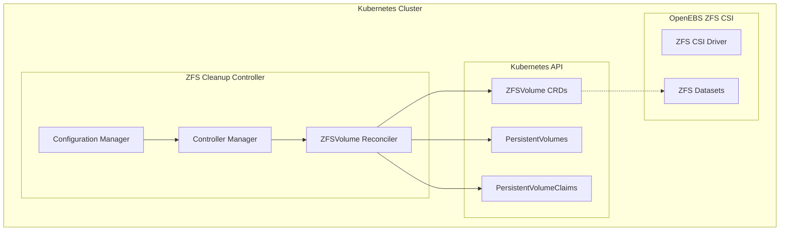

# Design Document

## Overview

The ZFSVolume Cleanup Controller is a Kubernetes-native application written in Go that automatically identifies and removes orphaned ZFSVolume Custom Resource Definitions (CRDs) from OpenEBS ZFS CSI deployments. The controller implements a reconciliation loop that periodically scans for ZFSVolumes without corresponding PersistentVolumes or PersistentVolumeClaims and safely removes them.

The design follows Kubernetes controller patterns using the controller-runtime framework, ensuring reliable operation, proper error handling, and integration with cluster RBAC and observability systems.

## Architecture

### High-Level Architecture



### Deployment Patterns

The controller supports two deployment patterns:

1. **CronJob Pattern**: Executes cleanup operations on a scheduled basis
2. **Long-Running Service Pattern**: Continuously runs with configurable reconciliation intervals

### Core Components

1. **Controller Manager**: Main entry point that initializes the controller runtime
2. **ZFSVolume Reconciler**: Core business logic for identifying and cleaning orphaned volumes
3. **Configuration Manager**: Handles environment variables and configuration validation
4. **Metrics Collector**: Exposes Prometheus metrics for monitoring
5. **Health Check Handler**: Provides liveness and readiness probes

## Components and Interfaces

### ZFSVolume Reconciler

The reconciler implements the core cleanup logic:

```go
type ZFSVolumeReconciler struct {
    client.Client
    Scheme     *runtime.Scheme
    Config     *Config
    Metrics    *MetricsCollector
    Logger     logr.Logger
}

type ReconcileResult struct {
    OrphanedVolumes   []string
    DeletedVolumes    []string
    FailedDeletions   []string
    ProcessingErrors  []error
}
```

**Key Methods:**
- `Reconcile()`: Main reconciliation loop entry point
- `findOrphanedZFSVolumes()`: Identifies volumes without PV/PVC references
- `validateDeletion()`: Performs safety checks before deletion
- `deleteZFSVolume()`: Handles actual volume deletion with retries

### Configuration Manager

Manages all controller configuration through environment variables:

```go
type Config struct {
    // Execution mode
    DryRun          bool
    ReconcileInterval time.Duration
    
    // Safety settings
    MaxConcurrentReconciles int
    RetryBackoffBase       time.Duration
    MaxRetryAttempts       int
    
    // Filtering options
    NamespaceFilter        string
    LabelSelector          string
    
    // Logging
    LogLevel               string
    LogFormat              string
}
```

### Metrics Collector

Exposes Prometheus metrics for observability:

```go
type MetricsCollector struct {
    OrphanedVolumesTotal    prometheus.CounterVec
    DeletionAttemptsTotal   prometheus.CounterVec
    ReconciliationDuration  prometheus.HistogramVec
    LastReconcileTime       prometheus.GaugeVec
}
```

### Volume Relationship Checker

Handles the core logic for determining if a ZFSVolume is orphaned:

```go
type VolumeChecker struct {
    client.Client
    logger logr.Logger
}

func (vc *VolumeChecker) IsOrphaned(ctx context.Context, zfsVol *zfsv1.ZFSVolume) (bool, error)
func (vc *VolumeChecker) FindRelatedPV(ctx context.Context, zfsVol *zfsv1.ZFSVolume) (*corev1.PersistentVolume, error)
func (vc *VolumeChecker) FindRelatedPVC(ctx context.Context, pv *corev1.PersistentVolume) (*corev1.PersistentVolumeClaim, error)
```

## Data Models

### ZFSVolume CRD Structure

The controller works with OpenEBS ZFSVolume CRDs that have this structure:

```yaml
apiVersion: zfs.openebs.io/v1
kind: ZFSVolume
metadata:
  name: pvc-12345678-1234-1234-1234-123456789012
  namespace: openebs
spec:
  capacity: "10Gi"
  fsType: "ext4"
  poolName: "zfspv-pool"
  volumeType: "DATASET"
status:
  state: "Ready"
```

### Relationship Mapping

The controller identifies relationships through these fields:

1. **ZFSVolume → PV**: Match `zfsVolume.metadata.name` with `pv.spec.csi.volumeHandle`
2. **PV → PVC**: Match `pv.spec.claimRef.name` and `pv.spec.claimRef.namespace`

### Configuration Schema

```yaml
apiVersion: v1
kind: ConfigMap
metadata:
  name: zfsvolume-cleanup-config
data:
  dry-run: "false"
  reconcile-interval: "1h"
  max-concurrent-reconciles: "1"
  retry-backoff-base: "1s"
  max-retry-attempts: "3"
  namespace-filter: ""
  label-selector: ""
  log-level: "info"
```

## Error Handling

### Retry Strategy

The controller implements exponential backoff for transient failures:

```go
type RetryConfig struct {
    BaseDelay    time.Duration
    MaxDelay     time.Duration
    Multiplier   float64
    MaxAttempts  int
}
```

### Error Categories

1. **Transient Errors**: API server unavailable, network timeouts
   - Action: Retry with exponential backoff
   - Max attempts: 3

2. **Permanent Errors**: RBAC permission denied, CRD not found
   - Action: Log error and skip resource
   - No retry

3. **Concurrent Modification**: Resource being deleted by another process
   - Action: Log and continue (success case)
   - No retry needed

### Graceful Degradation

- If ZFSVolume CRD is not available, controller logs warning and exits gracefully
- If PV/PVC access fails, controller skips safety checks and logs errors
- If metrics endpoint fails, controller continues operation without metrics

## Testing Strategy

### Unit Testing

1. **Reconciler Logic Tests**
   - Mock Kubernetes client for API interactions
   - Test orphan detection logic with various PV/PVC states
   - Verify dry-run mode behavior
   - Test error handling and retry logic

2. **Configuration Tests**
   - Validate environment variable parsing
   - Test configuration validation logic
   - Verify default value handling

3. **Metrics Tests**
   - Verify metric collection and exposure
   - Test metric accuracy under various scenarios

### Integration Testing

1. **Kubernetes Integration**
   - Use envtest for realistic API server interactions
   - Test RBAC permissions and ServiceAccount setup
   - Verify controller behavior with real CRDs

2. **End-to-End Scenarios**
   - Create test ZFSVolumes, PVs, and PVCs
   - Verify correct orphan identification
   - Test actual deletion operations
   - Validate metrics and logging output

### Performance Testing

1. **Scale Testing**
   - Test with large numbers of ZFSVolumes (1000+)
   - Verify memory usage and processing time
   - Test rate limiting effectiveness

2. **Stress Testing**
   - Concurrent reconciliation scenarios
   - API server throttling conditions
   - Resource contention handling

### Security Testing

1. **RBAC Validation**
   - Verify minimal required permissions
   - Test behavior with insufficient permissions
   - Validate ServiceAccount isolation

2. **Input Validation**
   - Test with malformed CRDs
   - Verify handling of unexpected field values
   - Test configuration injection scenarios

## Deployment Considerations

### RBAC Requirements

```yaml
apiVersion: rbac.authorization.k8s.io/v1
kind: ClusterRole
metadata:
  name: zfsvolume-cleanup-controller
rules:
- apiGroups: ["zfs.openebs.io"]
  resources: ["zfsvolumes"]
  verbs: ["list", "get", "delete"]
- apiGroups: [""]
  resources: ["persistentvolumes"]
  verbs: ["list", "get"]
- apiGroups: [""]
  resources: ["persistentvolumeclaims"]
  verbs: ["list", "get"]
```

### Resource Requirements

```yaml
resources:
  requests:
    memory: "64Mi"
    cpu: "10m"
  limits:
    memory: "128Mi"
    cpu: "100m"
```

### Health Checks

- **Liveness Probe**: HTTP endpoint checking controller health
- **Readiness Probe**: Validates API server connectivity and CRD availability
- **Startup Probe**: Ensures controller initialization completes

### Monitoring Integration

- Prometheus metrics endpoint on `:8080/metrics`
- Structured logging compatible with Fluentd/Fluent Bit
- Optional integration with OpenTelemetry for distributed tracing
